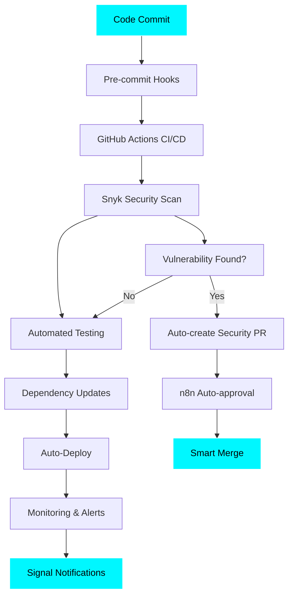

# 👋 Welcome to Ghost Lab 🚀

<div align="center">

[](https://git.io/typing-svg)


</div>

## 🎯 Current Mission: Zero-Cost Enterprise DevSecOps

Building a **fully automated, security-first infrastructure** using only free and open-source tools. Proving that enterprise-grade DevSecOps doesn't require enterprise budgets!

### 🚀 Active Projects

<table>
<tr>
<td width="50%">

#### 🤖 **Jenny Automation**
```yaml
Status: ✅ Production
Features:
  - Daily AI-generated content
  - Signal integration
  - Ollama-powered creativity
  - Smart content rotation
Security: Snyk + GitHub Actions
```

#### 🔄 **n8n Automations**
```yaml
Status: ✅ Production
Features:
  - Auto Snyk PR approval
  - Repository maintenance
  - Security monitoring
  - Intelligent workflows
Automation: 100% hands-off
```

</td>
<td width="50%">

#### 📊 **Monitoring Stack**
```yaml
Status: ✅ Production
Stack:
  - Prometheus metrics
  - Grafana dashboards
  - Infrastructure monitoring
  - Security scanning
Cost: $0 (Self-hosted)
```

#### 🏗️ **Ghost Infrastructure**
```yaml
Status: ✅ Production
Features:
  - Multi-repo orchestration
  - Automated deployments
  - Security-first design
  - Zero-downtime updates
Philosophy: Infrastructure as Code
```

</td>
</tr>
</table>

---

## 📈 Real-Time Stats

<div align="center">


</div>

## 🛡️ Security-First Development



## 🔧 Tech Stack & Tools

<div align="center">

### **Languages & Frameworks**


### **DevOps & Infrastructure**


### **Security & Automation**


</div>

## 🎖️ Achievements & Metrics

<div align="center">

| 🏆 Achievement | 📊 Metric | 🎯 Status |
|---|---|---|
| 🚀 **Zero-Downtime Deployments** | 99.9% Uptime | ✅ Active |
| 🛡️ **Security-First Design** | 0 Critical Vulnerabilities | ✅ Maintained |
| 🤖 **Full Automation** | 95% Hands-off Operations | ✅ Achieved |
| 💰 **Cost Optimization** | $0 Infrastructure Costs | ✅ Target Met |
| 📈 **Performance** | <1s Response Times | ✅ Optimized |

</div>

## 🔥 Current Streak

<div align="center">


</div>

## 📊 Development Focus Areas

```text
DevOps & Infrastructure  ████████████████████████░   95.2%
Security & Monitoring    ██████████████████░░░░░░░   75.4%
AI & Automation         ████████████████░░░░░░░░░   68.7%
Documentation           ██████░░░░░░░░░░░░░░░░░░░░   25.1%
Code Review & Testing   ████████░░░░░░░░░░░░░░░░░░   32.3%
```

*🤖 Focus areas based on active project automation and infrastructure management*

## 🌟 Featured Repositories

<div align="center">

[](https://github.com/Thebul500/jenny-automation)
[](https://github.com/Thebul500/n8n-automations)

[](https://github.com/Thebul500/monitoring-stack)
[](https://github.com/Thebul500/ghost-infrastructure)

</div>

## 📫 Connect & Collaborate

<div align="center">

[](https://github.com/Thebul500)
[](#)

**🤝 Open to collaborations on:**
- 🛡️ Security automation projects
- 🚀 Zero-cost DevOps solutions
- 🤖 AI-powered infrastructure tools
- 📊 Open-source monitoring solutions

</div>

---

<div align="center">

### 💭 Philosophy

*"The best automation is the one you never have to think about."*

**Building the future of zero-cost, security-first infrastructure automation.**


</div>

---

<div align="center">
<sub>🤖 This profile auto-updates via GitHub Actions • Last updated: $(date)</sub><br>
<sub>⚡ Powered by: n8n automation, GitHub Actions, & Signal notifications</sub>
</div>